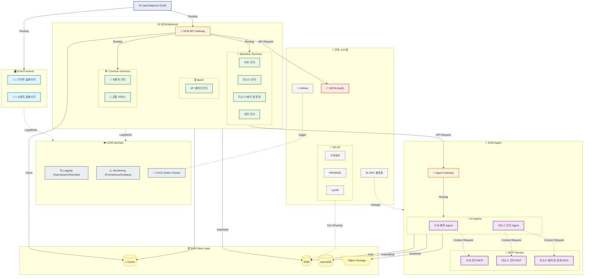

# 🏗️ SCM Microservices Architecture

> SCM 시스템의 전체 마이크로서비스 리포지토리 구성 및 아키텍처 구조를 정의합니다.

## 🗺️ Architecture Overview

---

## 🖥️ SCM Frontend
> 사용자 및 관리자가 시스템과 상호작용하는 접점(Web Interface)을 구성하는 웹 애플리케이션 및 자체 UI 환경입니다.

### 🎯 Frontend Applications
| Repository 명 | 대상 사용자 | 주요 기능 | 기술 스택 권장 |
| :--- | :--- | :--- | :--- |
| **`scm-admin-web`** | 관리자, 분석가 | 시스템 관리, 분석, 설정 | React + 복잡한 차트 라이브러리 |
| **`scm-user-web`** | 일반 사용자 | 업무 처리, 조회, 입력 | React |

### 🛠️ Shared Frontend Resources
| Repository 명 | 용도 | 설명 |
| :--- | :--- | :--- |
| **`scm-ui-components`** | 공통 컴포넌트 | 재사용 가능한 UI 컴포넌트 라이브러리 |

### 📌 특이사항
> 프로젝트 요구사항 및 운영 환경에 따라 분리된 프론트엔드 레포지토리(`scm-admin-web`, `scm-user-web`)를 하나로 통합하여 **단일 애플리케이션(Single Application)** 구조로 구축 및 운영할 수도 있습니다.

---

## ⚙️ SCM Backend
> 도메인 비즈니스 로직을 처리하는 핵심 마이크로서비스 및 시스템 전반을 지원하는 공통 서비스 영역입니다.

### 🚪 API Gateway Layer
| 구분 | Repository 명 | 설명 |
| :--- | :--- | :--- |
| **API Gateway** | **`scm-gateway`** | 외부 트래픽 단일 진입점. API 라우팅, 로드 밸런싱 및 토큰(JWT) 기반 통합 보안(인가) 검증 처리 |

### 🎯 Core Business Services
| 영역 | Repository 명 | 설명 |
| :--- | :--- | :--- |
| **수요 관리** | **`scm-demand-service`** | 중장기 수요 관리, 단기 수요 관리 |
| **리소스 관리** | **`scm-resource-service`** | 리소스(인력) 공급계획, 외부 리소스 관리 |
| **리소스 배치 및 운영** | **`scm-operation-service`** | 인력 배치/Teaming, 리소스 배치 최적화 |
| **성과 관리** | **`scm-performance-service`** | 프로젝트 역량(인력) 평가, 결과 제공 |

### 🛠️ Common/Shared Services
| 구분 | Repository 명 | 설명 |
| :--- | :--- | :--- |
| **사용자 관리** | **`scm-account-service`** | OKTA 연동 기반 사용자 인증(로그인) 및 토큰 발급, 사용자 프로필 및 세부 권한(Role) 그룹 관리 |
| **공통 서비스** | **`scm-common-service`** | 시스템 설정, 메뉴, 코드 관리 |

### ⏳ Batch / Data Integration
| 구분 | Repository 명 | 설명 |
| :--- | :--- | :--- |
| **데이터 연계 (Batch)** | **`scm-eai-service`** | EAI I/F를 통해 수신한 데이터를 정제/가공하여 SCM Schema로 이관 |

---

## 🤖 SCM AI Agent
> 데이터 기반 분석과 시뮬레이션을 통해 사용자에게 최적화된 의사결정을 지원하는 AI 에이전트 및 연계 인프라 영역입니다.

### 🎯 AI Agents
| 구분 | Repository 명 | 설명 |
| :--- | :--- | :--- |
| **수요 예측 Agent** | **`scm-demand-agent`** | 데이터/트렌드 기반 중장기 및 단기 수요 예측 수행 |
| **리소스 배치 최적화 Agent**| **`scm-operation-agent`** | 제약 사항(스킬, 일정 등)을 고려한 최적의 인력 투입 및 배치 제안 |

### 🔌 MCP (Model Context Protocol) Servers
| 구분 | Repository 명 | 설명 | 연동 대상(도메인) |
| :--- | :--- | :--- | :--- |
| **수요 관리 MCP** | **`scm-demand-mcp`** | 에이전트가 수요 데이터를 조회하고 분석할 수 있도록 컨텍스트 연동 | 수요 관리 서비스 |
| **리소스 관리 MCP** | **`scm-resource-mcp`** | 인력 풀 상태 및 프로필/역량 정보를 에이전트에 제공 | 리소스 관리 서비스 |
| **리소스 배치 MCP** | **`scm-operation-mcp`** | 배치 시뮬레이션 실행 및 최적화 엔진 제어 도구 제공 | 리소스 배치 및 운영 서비스 |

### 📌 특이사항
> **NPO(No People Operation)** 플랫폼 도입 상황에 따라 전체 AI Agent 아키텍처 구성 및 배포 구조가 변경될 수 있습니다.
> 추가적으로 에이전트의 안정적 운영 및 관리를 위해 요청을 통제하는 **Agent Gateway**, 철저한 접근 권한 관리를 위한 **Agent IAM**, 에이전트의 추론 및 동작 상태 관측을 위한 **Observability(관측성)** 제공을 고려하여 설계하는 것이 권장됩니다.

---

## ☁️ SCM DevOps (Platform & CI/CD)
> 시스템(Frontend/Backend)의 안정적인 운영, 모니터링, 그리고 효율적인 CI/CD 배포 파이프라인을 지원하는 기반 환경 영역입니다.

### 🎯 Observability Services
| 구분 | Repository 명 | 설명 | 주요 오픈소스 |
| :--- | :--- | :--- | :--- |
| **Logging** | **`scm-logging`** | 일원화된 애플리케이션 로깅 파이프라인 구축 및 수집 | OpenSearch, fluentbit |
| **Monitoring** | **`scm-monitoring`** | 애플리케이션 메트릭 수집, 대시보드 구성 및 알림 | Prometheus, Grafana |

### 🔄 CI/CD
| 구분 | Repository 명 | 설명 |
| :--- | :--- | :--- |
| **Helm Charts** | **`scm-cicd`** | Frontend/Backend의 Helm Chart 템플릿 보관 |

> **⚠️ 주의 사항:** 소스 코드 형상 관리(VCS)는 **GitHub** 사내 표준 저장소 사용으로 확정되었으나, 실제 빌드 및 배포를 수행할 구체적인 **CI/CD 파이프라인 도구**(예: GitHub Actions, Jenkins, ArgoCD 등) 및 자동화 방안에 대해서는 아직 확정되지 않아 추가적인 확인과 논의가 필요합니다.

### 📌 특이사항 및 역할(R&R)
> 본 영역(DevOps)에서는 인프라 구성 자체에 개입하지 않으며, 오퍼레이션을 위한 **애플리케이션 관측성(Observability)** 확보와 **CI/CD(배포 자동화)** 파이프라인 운영에 한정하여 책임을 가집니다.