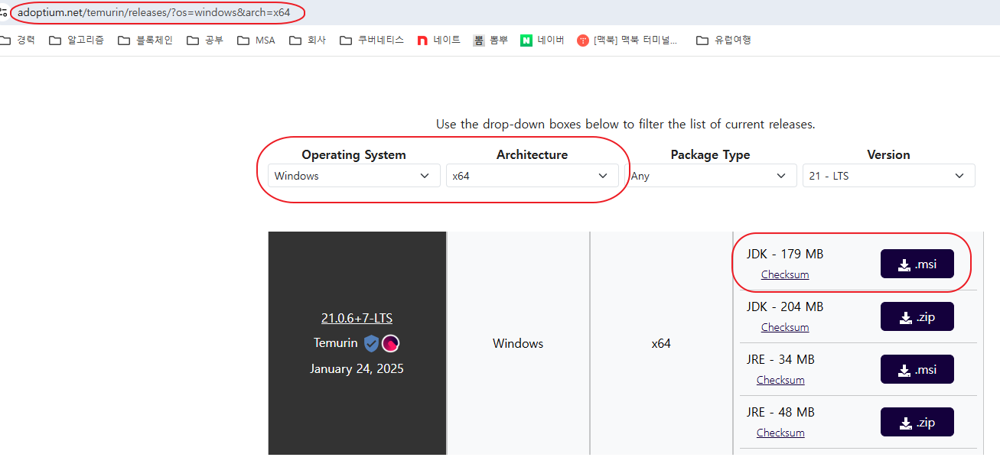
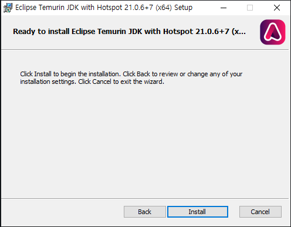
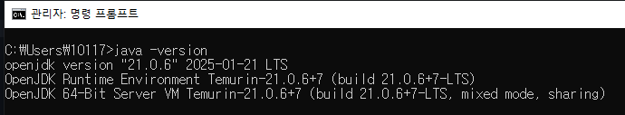
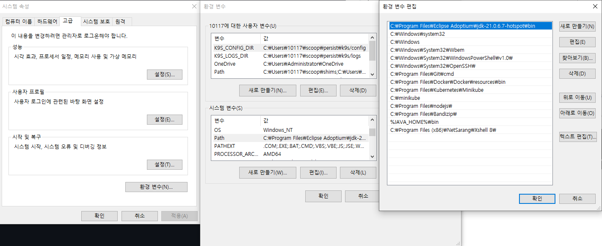
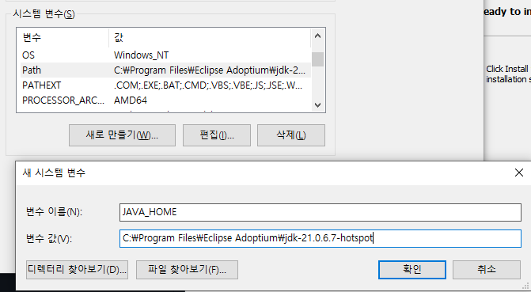
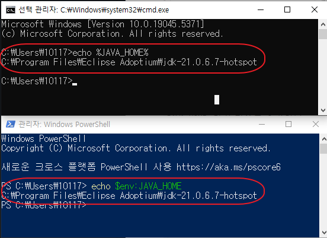
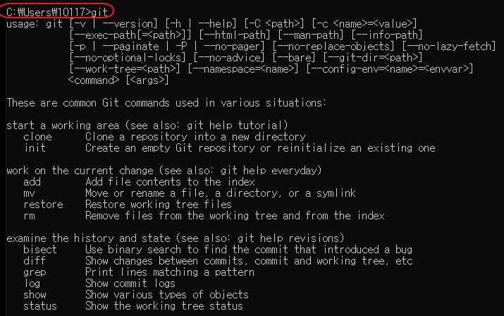

# 설치 가이드 상세

## 1. Open JDK 21
>
> Open JDK Eclipse Temurin 버전을 설치 합니다. (다른 Open JDK 를 써도 무방합니다)

### OpenJDK 다운로드

### OpenJDK 설치
>
> Next 버튼 클릭 후 Install 버튼 Finish 버튼

### OpenJDK 설치 확인 및 환경변수 추가
>
> 설치가 정상적으로 되었는지 확인하기 위해 `CMD 또는 PowerShell` 를 실행후 `java -version`을 입력하여 21 버전이 정상적으로 설치 되었는지 확인

- 만약, 버전정보가 정상적으로 보이지 않는다면 "시스템 환경변수"에 직접 입력 후, 실행 창을 재시작하고 입력한다.
- 시스템 속성 -> 환경 변수 -> 시스템 변수 영역의 **편집** -> 새로 만들기

- `JAVA_HOME` 환경 변수를 추가한다.
- 시스템 속성 -> 환경 변수 -> 시스템 변수 영역의 **새로 만들기** -> 변수이름: JAVA_HOME, 변수값: JDK 설치 디렉토리

- CMD 또는 PowerShell 실행 후 적용 되었는지 확인
  - CMD : echo %JAVA_HOME%
  - PowerShell : echo $env:JAVA_HOME
  

## 2. GIT
>
> Git 설치 프로그램을 실행 후 git 명령어가 정상 수행 되는지 확인합니다.

## 3. IDE (VSCode)
>
> VSCode를 설치하고 Java 개발 확장을 추가합니다.

- [VSCode 다운로드](https://code.visualstudio.com/)
- 확장 설치
  - `Extension Pack for Java`
  - `Lombok Annotations Support for VS Code`

### JDK 21 설정
>
> VSCode에서 Java 확장 실행 시 JDK 21 경로를 선택하거나, 필요 시 `JAVA_HOME` 환경 변수를 사용합니다.

### Gradle 사용 방식
>
> 이 프로젝트는 **Gradle Wrapper**를 사용하므로 Gradle 별도 설치는 필수가 아닙니다.
>
> - Windows: `.\gradlew.bat bootRun`, `.\gradlew.bat clean test`
> - macOS/Linux: `./gradlew bootRun`, `./gradlew clean test`

---

### 🔙 Navigation
- [가이드 목록으로 돌아가기](100-developer-environment-guide.md)