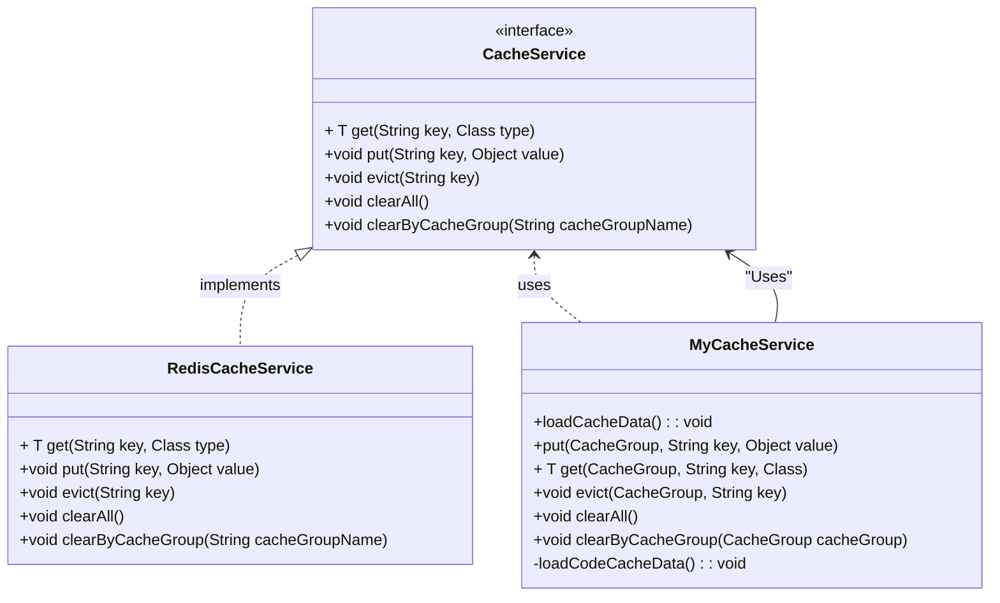

# 캐시 사용 가이드
> 캐시 기능 구현 및 활용에 대한 방향을 제공합니다.  
> 환경파일(yml)의 Redis 연결 설정, 의존성, 주요 서비스 클래스 사용법을 다룹니다.  
> 비즈니스 캐시는 **Redis**(`RedisCacheService`)를 사용합니다. 연결은 `spring.data.redis`로 설정합니다.

## 목차
1. [캐시 구성 요소](#1-캐시-구성-요소)
   - [1.1 패키지 구성](#11-패키지-구성)
   - [1.2 디렉토리 예시](#12-디렉토리-예시)
   - [1.3 CacheService Interface](#13-cacheservice-interface)
   - [1.4 커스텀 Cache Service (MyCacheService)](#14-커스텀-cache-service-myCacheservice)
       - [1.4.1 CacheGroup (enum)](#141-구성요소-cachegroup-enum)
       - [1.4.2 MyCacheService](#142-mycacheservice)
       - [1.4.3 CacheController](#143-cachecontroller)
2. [Config 설정](#2-캐시-설정-springconfig-및-applicationyml-)
   - [2.1 CacheConfig](#21-cacheconfig)
   - [2.2 application.yml (Redis 연결)](#22-applicationyml-redis-연결)
3. [캐시 사용 예제](#3-캐시-사용-예제)
4. [참고 사항 (구현체 간 관계)](#4-참고-사항-구현체-간-관계)

---

## 1. 캐시 구성 요소

### 1.1 패키지 구성
캐시 관련 기능은 다음과 같이 패키지별로 정리됩니다:

- **`scm.common.app.cache`**:
    - 캐시의 인터페이스를 정의하고 실제 구현할 캐시를 정의한다.   
    - CacheConfig를 통하여 의존성이 주입되도록 한다.
- **`scm.common.biz.common`**:
    - 프로젝트에서 사용하는 캐시 서비스를 별도로 구성하여 사용한다. 예시 MyCacheService

### 1.2 디렉토리 예시
`scm-common-service` 모듈 기준 실제 경로는 아래와 같습니다. (소스 루트: `src/main/java`)

```
src/main/java/scm/common/
├── app/
│   └── cache/
│       ├── CacheConfig.java
│       ├── CacheService.java
│       └── RedisCacheService.java
└── biz/
    └── common/
        ├── constants/
        │   └── CacheGroup.java
        ├── service/
        │   └── MyCacheService.java
        └── controller/
            └── CacheRestController.java
```

- 캐시 API는 **`CacheRestController`** (`/api/v1/common/cache`) 에서 제공합니다.  
- `biz/common` 아래에는 JPA·MyBatis 공용 설정 등 **`infrastructure/`** 등 다른 패키지도 있으나, 캐시 가이드 범위에서는 위 파일들이 핵심입니다.

### 1.3 CacheService Interface
최상위 캐시 인터페이스 아래와 같이 정의 합니다.  
구현체는 **`RedisCacheService`** 하나이며, `CacheConfig`에서 `RedisTemplate`과 함께 등록됩니다.
```java
public interface CacheService {
    <T> T get(String key, Class<T> type);
    void put(String key, Object value);
    void evict(String key);
    void clearAll();
    void clearByCacheGroup(String cacheGroupName);
}
```

### 1.4 커스텀 Cache Service (MyCacheService)
프로젝트 상황에 맞게 커스텀하여 캐시 서비스를 구성할 수 있습니다. 본 가이드에서는 MyCacheService를 생성하여 구성하였습니다.
`MyCacheService`의 경우 `CacheGroup` 이란 논리 그룹과 `초기적재기능`을 추가하였습니다. 

#### 1.4.1 구성요소: `CacheGroup (enum)` 
사용할 캐시그룹을 정의합니다. 캐시그룹은 반드시 정의하여 무분별한 캐시 남용을 제한 합니다.  
캐시그룹은 여러개의 캐시 키를 가질 수 있습니다.
- **사용 예제**:
    ```java
      myCacheService.get(CacheGroup.CODE, condition.getCode(), 객체 타입);
      myCacheService.put(CacheGroup.CODE, 객체);
    ```
---

#### 1.4.2 `MyCacheService` 
캐시 데이터를 `초기적재, 저장, 삭제, 초기화, 캐시네임별 초기화, 캐시 delemiter` 를 정의합니다.
`CacheService` 구현은 **Redis**만 사용합니다.

##### 주요 메서드
```java
public void loadCacheData();
public <T> T get(CacheGroup cacheGroup, String key, Class<T> clazz);
public void put(CacheGroup cacheGroup, String key, Object value);
public void evict(CacheGroup cacheGroup, String key);
public void clearAll();
public void clearByCacheGroup(CacheGroup cacheGroup);
```

##### 동작
- `loadCacheData`: 애플리케이션 기동 시 캐시 초기화 시점 로그를 남깁니다.
- `get`: 캐시그룹 기준으로 특정키값의 데이터를 가져옵니다. (캐시에 저장된 객체 타입과 동일해야함.)
- `put`: 캐시그룹에 해당 키와 데이터를 저장합니다.
- `evict`: 캐시그룹의 특정 키에 대한 데이터를 삭제합니다.
- `clearAll`: 캐시의 모든 데이터를 비웁니다.
- `clearByCacheGroup`: 특정 캐시그룹의 모든 데이터를 비웁니다.

##### 샘플예시
```java
@RequiredArgsConstructor
@Slf4j
public class MyCacheService {

    public static final String DELIMITER = ":";
    private final CacheService cacheService;

    @Transactional
    @EventListener(ApplicationReadyEvent.class)
    public void loadCacheData() {
        log.info("캐시 적재 완료 (Redis)");
    }
}
```
---

#### 1.4.3 `CacheController` 
캐시를 관리하고 외부에서 호출할 수 있는 API를 제공하는 Cache Controller.

##### 주요 기능
1. 캐시 전체 초기화
2. 캐시그룹명 기준 전체 초기화
3. 특정 캐시그룹의 `캐시 키`를 제거한다

##### 기본 REST API 예제
```java
@RestController
@RequestMapping("/api/v1/common/cache")
@RequiredArgsConstructor
public class CacheRestController {

    private final MyCacheService myCacheService;


    @GetMapping("/clear/{cacheGroupName}")
    public ApiResponse<Void> clear(@PathVariable String cacheGroupName) {
        if (StringUtils.isEmpty(cacheGroupName)) {
            myCacheService.clearAll();
        } else {
            myCacheService.clearByCacheGroup(CacheGroup.getByName(cacheGroupName));
        }
        return ApiResponse.ok(null);
    }

    @GetMapping("/evict/{cacheGroupName}/{cacheKey}")
    public ApiResponse<Void> evict(@PathVariable String cacheGroupName, @PathVariable String cacheKey) {

        CacheGroup cacheGroup = CacheGroup.getByName(cacheGroupName);
        if (cacheGroup == null) {
            return ApiResponse.fail(new CustomException(ErrorCode.NOT_FOUND_ELEMENT));
        }

        myCacheService.evict(cacheGroup, cacheKey);
        return  ApiResponse.ok(null);
    }
}
```
---

## 2. 캐시 설정 (SpringConfig 및 application.yml)  
캐시는 **항상 Redis**를 사용하며, 연결 정보는 `spring.data.redis`로 지정합니다.

### 2.1 `CacheConfig`
`RedisTemplate<String, Object>`(Jackson 직렬화)와 `CacheService` → `RedisCacheService` 빈을 등록합니다.

- **CacheConfig.java 요약**: 
    ```java
    @Configuration
    public class CacheConfig {

        @Bean
        public RedisTemplate<String, Object> redisTemplate(RedisConnectionFactory connectionFactory) {
            // … ObjectMapper + GenericJackson2JsonRedisSerializer 설정
            return redisTemplate;
        }

        @Bean
        public CacheService cacheService(RedisTemplate<String, Object> redisTemplate) {
            return new RedisCacheService(redisTemplate);
        }
    }
    ```

### 2.2 application.yml (Redis 연결)
루트 `application.yml`의 `spring.data.redis`를 환경에 맞게 조정합니다. 비밀번호 등은 환경 변수로 덮어쓸 수 있습니다.

```yaml
spring:
  data:
    redis:
      host: ${REDIS_HOST:localhost}
      port: ${REDIS_PORT:6379}
      password: ${REDIS_PASSWORD:password123}
      database: ${REDIS_DATABASE:0}
      timeout: 60s
```
---

## 3. 캐시 사용 예제
아래 사용 예시의 경우 MyCacheService를 선언하여 사용하는 예제입니다.  
간략히 프로세스를 설명하자며 다음과 같습니다.   
`캐시조회->존재할경우 리턴, 존재하지 않을경우 DB 조회 후 캐시 추가 후 리턴`

```java

@Service
@RequiredArgsConstructor
@Slf4j
public class CodeServiceImpl implements CodeService {
    private final MyCacheService myCacheService;

    @Override
    public Code findByCode(CodeSearchCondition condition) {
        if (condition.getCode() != null) {

            // 캐시 조회
            Code cachedCode = myCacheService.get(CacheGroup.CODE, condition.getCode(), Code.class);
            if (cachedCode != null) {
                return cachedCode;
            }

            // DB 조회
            Code dbCode = codeRepository.findByCode(condition);

            // 루트 요소일 경우 캐시 추가
            if (dbCode != null && dbCode.getParentCodeId() == null) {
                myCacheService.put(CacheGroup.CODE, condition.getCode(), dbCode);
            }
            return dbCode;
        }
        return null;
    }
}
```

---

## 4. 참고 사항 (CacheService 인터페이스, 구현체, MyCacheService 관계)



---

### 🔙 Navigation
- [가이드 목록으로 돌아가기](guide.md)

