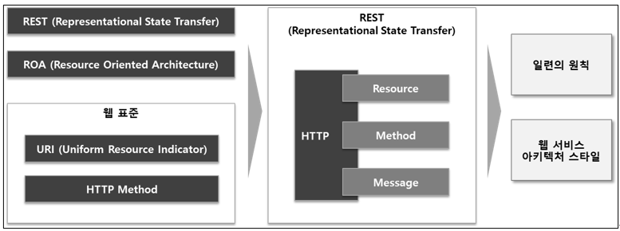
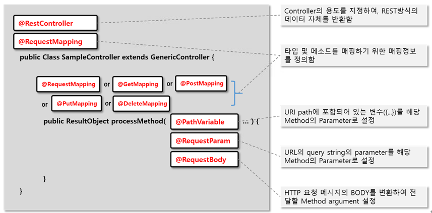

# API URI 작성 가이드
> API URI 설계에서 가장 중요한 것은 리소스(Resource)를 식별하는 것 입니다.<Br>
> HTTP 메서드와 특징, 이를 기반으로 한 API 설계가 되어야 합니다.<Br>
> 본 가이드는 API URI 의 표준을 정의하며, 이를 통해 URI만 보고 자원 및 동작 파악이 가능하고 일관성과 명확성을 향상시킵니다.

---
## 목차
1. [API 표준](#1-API-표준)  

2. [구성 요소](#2-구성-요소)  
   2.1 [자원(Resource): URI](#21-자원resource-uri)   
   2.2 [행위(Verb): HTTP Method](#22-행위verb-http-method)  
   2.3 [메시지(Message): 내용](#23-메시지message-내용) 

3. [기본 구조 및 역할](#3-기본-구조-및-역할)

4. [URI 작성 표준](#4-URI-작성-표준)

5. [scm-common-service 현행 API (소스 기준)](#5-scm-common-service-현행-api-소스-기준)

--- 
## **1. API 표준**
- Open API 는 일반적인 REST API 기준으로 따르고 있으며, REST(Representational State Transfer)는
ROA(Resource Oriented Architecture)를 따르는 웹 서비스 아키텍처 스타일 이다.
- URI 와 HTTP Method 와 같은 웹 표준을 통해 객체화된 서비스에 어떻게 사용되어야 하는지에 대한 일련의 원칙을 정의 한다.
- 즉, REST 는 어떤 자원(Resource)에 어떤 행위(Method)를 어떻게(Message) 할지를 HTTP 기반으로 정한 아키텍처 스타일 이다. <br>


--- 
## **2. 구성 요소**
- Open API(REST API) 구성은 크게 **Resource(자원), Method(행위), Message(내용)** 과 같다.

--- 
### 2.1 자원(Resource): URI
- 접근할 자원(URI)를 정의하며, URI 는 자원을 표현하는데 집중 한다.
- 모든 자원은 고유한 ID가 존재하고, 이 자원은 Server 에 존재 한다.
- 자원을 구별하는 ID는 '/books/1' 와 같은 HTTP URI 이다.
- Client 는 URI 를 이용해서 자원을 지정하고, 해당 자원의 상태(정보)에 대한 조작을 Server 에 요청 한다.
<br><예시>

   | URI                                   | 의미                 |
   |---------------------------------------|--------------------|
   | https://api.domain.com/codes          | 코드 정보 Collection   |
   | https://api.domain.com/codes/100      | 100번 코드 정보         |
   | https://api.domain.com/codes/100/name | 100번 코드의 명칭        |

---

### 2.2 행위(Verb): HTTP Method
- 자원에 대한 처리 행위를 정의 한다.
- 행위에 대한 정의는 **HTTP METHOD 를 통해 표현** 한다.
- HTTP 프로토콜의 Method 를 사용 한다.
- HTTP 프로토콜은 **GET, POST, PUT, PATCH, DELETE** 와 같은 메서드를 제공 한다.
  - `GET`: 리소스 조회
  - `POST`: 요청 데이터 처리, 주로 등록에 사용
  - `PUT`: 리소스를 대체, 해당 리소스가 없으면 생성
  - `PATCH`: 리소스 부분 변경
  - `DELETE`: 리소스 삭제

---

### 2.3 메시지(Message): 내용
- 자원에 대한 처리 행위의 내용(Payload)을 정의 한다.
<br><예시>

   | Item        | Description                | Remark                                                                                                                                                                                                                                                                                                                                               |
   |-------------|----------------------------|------------------------------------------------------------------------------------------------------------------------------------------------------------------------------------------------------------------------------------------------------------------------------------------------------------------------------------------------------|
   | HTTP Header | Body의 Content Type을 명시 한다  | Content-Type: application/json<br/>Accept: application/json                                                                                                                                                                                                                                                                                           |
   | HTTP Body   | Body에 포함된 데이터를 통해 정보를 전달 한다 | JSON 포멧 사용                                                                                                                                                                                                                                                                                                                                           |
   | Status Code | 리소스 요청에 대한 응답 상태를 나타 낸다    | 200: 정상<br/>201: Request가 처리되었고, 새로운 자원 생성이 됨을 의미<br/>202: Request가 수락되었으나, Response메시지를 전달할 때까지 해당 프로세스가 완료되지 못한 경우<br/>204: Request처리 했지만, Client에게 전달할 새로운 정보가 없는 경우<br/>400: 잘못된 요청인 경우<br/>401: Request가 User 인증이 필요함을 Client에게 알려주기 위해 사용<br/>403: Request가 거절됨<br/>404: URI에 해당하는 자원을 찾을 수 없는 경우<br/>500: 서버에 예기치 않은 오류로 Request를 처리할 수 없는 경우 |

--- 
## **3. 기본 구조 및 역할**
- REST API 원칙을 따르는 Controller Class 및 Method 의 기본 구조와 역할은 다음과 같다.<br>
  
- REST API 를 표현하는 URL 의 기본 형식은 다음과 같으며, 업무영역(서비스) 및 모듈구분(단위 서비스)은 프로젝트 성격에 맞게 재정의하여 사용하면 된다.
  <br><예시>
  ```
      http(s)://[Domain Name]/[API Prefix]/[Part Area]/[Module]/[Resource Path]/[Path Variable]/?[Query String]
  ```  
  본 프로젝트(`scm-common-service`)는 대부분의 REST API에 **`/api/v1/common`** 을 API 버전·업무영역 접두로 둡니다. (메시징 예시 API만 `/api/messaging` 을 사용합니다.)

  | Attribute   | Description                              | Example (개념)                                                                    |
  |-------------|------------------------------------------|----------------------------------------------------------------------------|
  | Domain Name | 도메인 주소                                   | http(s)://<b>localhost:8082</b> (로컬 기본 포트는 `application.yml`의 `server.port`, 기본값 8082) |
  | API Prefix  | API 버전·공통 접두                           | http(s)://localhost:8082/<b>api/v1/common</b> …                              |
  | Part Area   | 업무영역(서비스) 구분 식별명                         | 예: …/api/v1/common/<b>users</b>, …/api/v1/common/<b>sample</b> …           |
  | Module      | 단위 업무영역(단위 서비스) 구분 식별명                   | 예: …/common/sample/<b>mybatis-items</b>                                    |
  | Resource Path | API 기능 제공을 위해 필요한 식별자                    | 예: …/common/export/<b>users</b>/csv                                         |
  | Path Variable  | API 기능 제공을 위해 필요한 parameter              | 예: …/mybatis-items/<b>{id}</b>                                              |
  | Query String   | API 기능 제공을 위해 보조적인 parameter 가 필요한 경우 사용 | 예: …/users<b>?page=0&size=20</b> (페이징 등)                                  |

---
## **4. URI 작성 표준**
- 모든 Resource 는 유일한 URI 로 정의 한다.
- HTTP 메서드와 URI 의 역할은 일치해야 한다.

  | HTTP Method | 역할        | 예제 URI          | 설명          |
  |-------------|-----------|-----------------|-------------|
  | GET         | 조회        | `/users`        | 사용자 목록 조회 (원칙 예시; 본 서비스 실제 경로는 [5절](#5-scm-common-service-현행-api-소스-기준) 참고)   |
  | GET         | 단건 조회     | `/users/1`      | 특정 사용자 조회   |
  | POST        | 생성        | `/users`        | 사용자 생성      |
  | PUT         | 수정        | `/users/1`      | 특정 사용자 수정   |
  | PATCH       | 부분 수정     | `/users/1`      | 특정 사용자 일부 수정 |
  | DELETE      | 삭제        | `/users/1`      | 특정 사용자 삭제   |

  > **참고:** 위 표는 HTTP 메서드와 URI 역할의 **일반적인 대응**을 보여줍니다. `scm-common-service`에서는 사용자 생성이 `POST /api/v1/common/users/signup`, 로그인이 `POST /api/v1/common/users/authenticate`처럼 **하위 경로(서브 리소스)** 로 나뉘어 있을 수 있습니다.

- URI 는 슬래시(`/`)로 hierarchical 하도록 구성 한다. <br> (상위 → 하위 관계는 `/`로 구분하며, 상위 경로는 하위 경로의 집합을 의미하는 단어로 구성)
  ```java
      GET /users/1/orders         // 특정 사용자의 주문 조회
      GET /products/1/reviews     // 특정 상품의 리뷰 조회
  ```
- Resource 는 동사 대신 명사로 표현해야 하며 행위가 URI 표현으로 들어가지 않도록 한다. <br> (CRUD 동작은 HTTP 메소드로 표현하므로..)
  
  <예제>
  ```java
      GET /users          // 사용자 목록 조회
      GET /users/1        // 특정 사용자 조회
      POST /users         // 사용자 생성
      PUT /users/1        // 특정 사용자 수정
      DELETE /users/1     // 특정 사용자 삭제
  ```  
  
  <잘못된 예제>
  ```java
      GET /getUsers         // 동사 사용 금지  
      POST /createUser      // 동사 사용 금지
  ```  
- URI 는 소문자로 작성해야 한다. <br> (대/소문자에 따라서 서로 다른 Resource 로 인식되어 혼란을 줄수 있음)

  <예제>
  ```java
      GET /users          // 소문자 사용
  ```  

  <잘못된 예제>
  ```java
      GET /Users         // 대문자 사용 금지
  ```  
- URI 는 확장자를 사용하지 않도록 한다. <br> (RESTful API 응답 포멧은 HTTP Header의 `Content-Type`으로 결정되므로 `.json`, `.xml` 같은 확장자는 사용하지 않음)
  ```java
      GET /users/1.json   // 확장자 사용 금지
  ```
- Collection 을 나타내는 경우 복수로 표현 한다.
  ```java
      GET /products        // 상품 목록 조회
      GET /orders          // 주문 목록 조회
  ```
- 언더스코어(`_`) 대신 하이픈(`-`)을 사용 한다.

  <예제>
  ```java
      GET /product-reviews   // 하이픈 사용
  ```  

  <잘못된 예제>
  ```java
      GET /product_reviews   // 언더스코어 사용 금지
  ```
- 필터링 및 정렬은 `Query Parameter` 를 사용 한다.

  <예제>
  ```java
      GET /products?category=shoes&color=red&sort=price
  ```  

  <잘못된 예제>
  ```java
      GET /products/category/shoes/color/red/sort/price   // 쿼리 파라미터로 처리해야 함
  ```  
- URL 인코딩이 필요한 문자는 사용하지 않는다.
- URI 마지막 문자는 슬래시(`/`)를 포함하지 않는다.
- 가능하면 짧고 의미가 있는 단어로 표현하여 URI 만으로 직관적으로 이해할 수 있도록 한다.

---
## **5. scm-common-service 현행 API (소스 기준)**
> 아래는 `scm-common-service` 소스의 `@RequestMapping`/HTTP Method와 `SecurityConfig` 기준으로 정리한 것입니다. 컨트롤러·보안 설정이 바뀌면 이 절도 함께 갱신하는 것을 권장합니다.

### 기본 URL·문서
| 항목 | 값 |
|---|---|
| 로컬 기본 호스트·포트 | `http://localhost:8082` (`server.port` 기본값 8082) |
| OpenAPI JSON | `/common/v3/api-docs` |
| Swagger UI | `/common/swagger-ui` |

### REST 컨트롤러 Base Path
| 구분 | `RequestMapping` (상대 경로) | 비고 |
|---|---|---|
| 사용자 | `/api/v1/common/users` | `POST …/signup`, `POST …/authenticate`, `GET …/`(페이징), `GET …/all`, `GET …/{id}`, `GET …/admin`, `PATCH …/`(본문으로 수정) |
| MyBatis 샘플 CRUD | `/api/v1/common/sample/mybatis-items` | `GET`/`POST` 목록·생성, `GET`/`PUT`/`DELETE …/{id}` 단건 |
| 캐시 | `/api/v1/common/cache` | `GET …/clear/{cacheGroupName}`, `GET …/evict/{cacheGroupName}/{cacheKey}` |
| 파일 | `/api/v1/common/files` | `POST …/upload`, `POST …/upload/multiple`, `POST …/download` |
| 로그(샘플) | `/api/v1/common/log` | `GET …/1`, `GET …/2` |
| 내보내기 | `/api/v1/common/export` | `GET …/users/csv`, `GET …/users/excel` |
| 요청 컨텍스트 | `/api/v1/common/context` | `POST …/set/{key}`, `GET …/get/{key}` |
| 메시징(예시) | `/api/messaging` | `POST …/pub`, `POST …/pull`, `POST …/sub` (위 `common` 접두와 **다른** 경로) |

### 인증/허용 정책 요약 (SecurityConfig + JWT Filter)
| 구분 | 경로 | 인증 필요 여부 |
|---|---|---|
| 허용(whitelist) | `/api/v1/common/users/signup`, `/api/v1/common/users/authenticate` | 불필요 |
| 허용(whitelist) | `/api/v1/common/cache/**`, `/api/v1/common/log/**` | 불필요 |
| 허용(whitelist) | `/common/v3/api-docs/**`, `/common/swagger-ui/**`, `/actuator/**` | 불필요 |
| 그 외 API | 나머지 전체 API | 필요 (JWT + Redis Allowlist 검증) |

> 참고: 인증 대상 API는 `Authorization: Bearer <token>`이 필요하며, `JwtRequestFilter`에서 JWT 유효성 + Redis 토큰 Allowlist를 함께 검증합니다.

### 구현된 주요 엔드포인트 (요약)
| Method | Path | 설명 |
|---|---|---|
| `POST` | `/api/v1/common/users/signup` | 회원가입 |
| `POST` | `/api/v1/common/users/authenticate` | 로그인/토큰 발급 |
| `GET` | `/api/v1/common/users` | 사용자 목록(페이징) |
| `GET` | `/api/v1/common/users/all` | 사용자 전체 목록 |
| `GET` | `/api/v1/common/users/{id}` | 사용자 단건 조회 |
| `PATCH` | `/api/v1/common/users` | 사용자 정보 수정 |
| `GET/POST` | `/api/v1/common/sample/mybatis-items` | 샘플 목록 조회/생성 |
| `GET/PUT/DELETE` | `/api/v1/common/sample/mybatis-items/{id}` | 샘플 단건 조회/수정/삭제 |
| `POST` | `/api/v1/common/files/upload`, `/upload/multiple`, `/download` | 파일 업/다운로드 |
| `GET` | `/api/v1/common/cache/clear/{cacheGroupName}`, `/evict/{cacheGroupName}/{cacheKey}` | 캐시 초기화/삭제 |
| `POST/GET` | `/api/v1/common/context/set/{key}`, `/get/{key}` | 컨텍스트 저장/조회 |
| `POST` | `/api/messaging/pub`, `/pull`, `/sub` | 메시징 예시 API (조건부 노출) |
| `GET` | `/api/v1/common/export/users/csv`, `/excel` | 사용자 데이터 내보내기 |

### 보안(Spring Security)과의 관계
- `SecurityConfig`의 `AUTH_WHITELIST`에 포함된 경로(예: `/api/v1/common/users/signup`, `/api/v1/common/users/authenticate`, Swagger·Actuator 일부 등)는 **인증 없이** 호출 가능합니다.
- 그 외 대부분의 API는 **JWT 인증**이 필요합니다. 상세 패턴은 `SecurityConfig`를 참고하세요.

---
### 🔙 Navigation
- [가이드 목록으로 돌아가기](guide.md)
